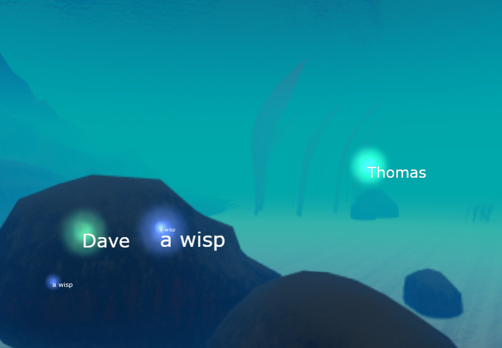

# Underwater Game
[](https://travis-ci.org/ebabel-games/underwater-game) [](https://david-dm.org/ebabel-games/underwater-game.svg)

Aquatic 3D HTML5 game of survival, fighting underwater creatures in a web browser.



## Install
You need [Node.js and npm](https://nodejs.org/) installed on your machine before installing this game dependencies.

```
npm install
```

## Development

### Build once
This build includes map file, which is useful for debugging while developing.

```
npm run build
```

### Build continuously for Development
```
npm run watch
```

### Run for Development
```
npm start
```

Browse http://localhost:3000

## Production
You could use [Digital Ocean](https://m.do.co/c/f500245f6b66) to deploy this game, or any server that can run a Node.js code with socket.io

## Build for Production
```
npm run build-production
```

## Run for Production
In your Production server, install `forever` cli globally, to make sure the node.js process keeps running.

```
[sudo] npm install forever -g
```

Once that's done (only once per machine), you can start for Production:
```
npm run start-production
```

## Run on Cloud9
It's possible to run this game in Cloud9. The package `forever` needs to be installed, node upgraded to the latest version instead of the default version 6 with `nvm install stable`.

```
npm run c9
```
